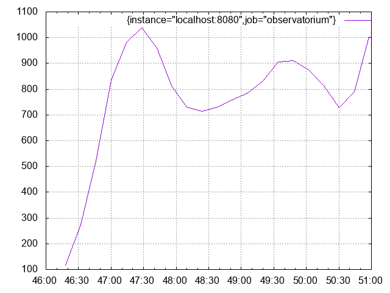
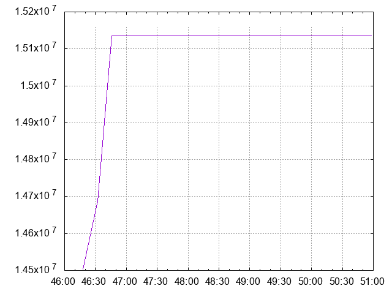
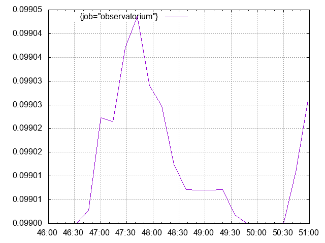
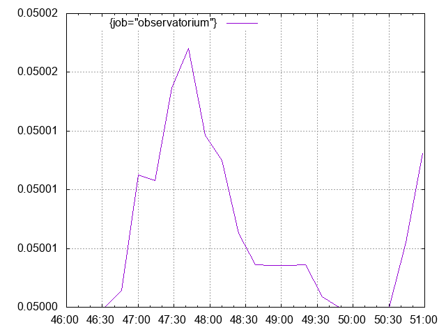
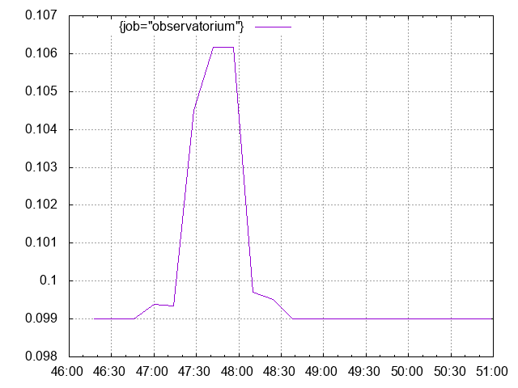
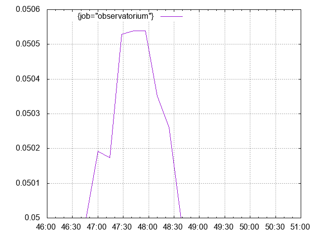
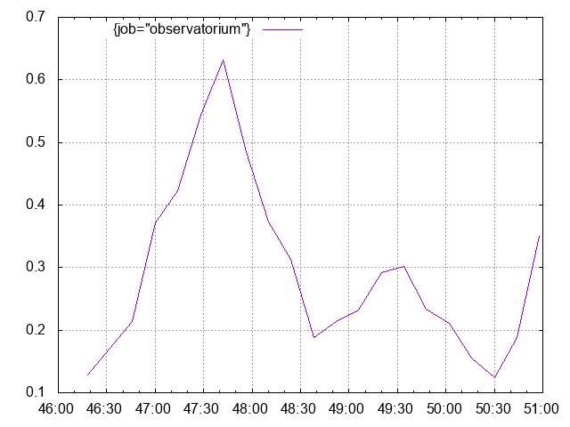

# Benchmark baseline results

This document contains baseline benchmark results for Observatorium API  under synthetic load.

Tested on:

```txt
(15-inch, 2019)
2,6 GHz 6-Core Intel Core i7
16 GB 2400 MHz DDR4
```

Generated using:

[embedmd]:# (../tmp/load_help.txt)
```txt
load.sh [-h] [-r n] [-c n] [-m n] [-q n] [-o csv|gnuplot] -- program to test synthetic load on observatorium api and report results.

where:
    -h  show this help text
    -r  set number of seconds to run (default: 300)
    -c  set number of cluster to simulate (default: 5000)
    -m  set number of machines per cluster to simulate (default: 2)
    -q  set number of concurrent queries to execute (default: 10)
    -o  set the output format (default: csv. options: csv, gnuplot)
```

With parameters:

```console
$ ./test/load.sh -r 300 -c 1000 -m 3 -q 10 -o gnuplot
```

> It runs tets for 5 minutes, simulating 3000 machines sending metrics and 10 consumers querying for their data every second.
> Observatorim API GW runs in-front of a mock provider which always responds with a successful response.

## Results

Most relevant results are the ones on resource consumption.
CPU usage is pretty much stable.
Memory usage correlates with the number of goroutines, which correlates the number of open connections.
Memory usage increases and request latencies increase as the backend services' load increase, which is expected.

### Resource consumption

#### CPU Usage

> `rate(process_cpu_seconds_total{job="observatorium"}[1m]) * 1000`



#### Memory Usage

> `process_resident_memory_bytes{job="observatorium"}'`



#### Number of Goroutines

> go_goroutines{job="observatorium"}'


### Latencies

#### Write Latency Percentiles

##### Write P99

> histogram_quantile(0.99, sum by (job, le) (rate(http_request_duration_seconds_bucket{job="observatorium", handler="write"}[1m])))'



##### Write P50

> histogram_quantile(0.50, sum by (job, le) (rate(http_request_duration_seconds_bucket{job="observatorium", handler="write"}[1m])))'



##### Write Average

> 100 * (sum by (job) (rate(http_request_duration_seconds_sum{job="observatorium", handler="write"}[1m])) * 100
> /
> sum by (job) (rate(http_request_duration_seconds_count{job="observatorium", handler="write"}[1m])))'


#### Query Range Latency Quartiles

##### Query P99

> histogram_quantile(0.99, sum by (job, le) (rate(http_request_duration_seconds_bucket{job="observatorium", handler="query_range"}[1m])))'



##### Query P50

> histogram_quantile(0.50, sum by (job, le) (rate(http_request_duration_seconds_bucket{job="observatorium", handler="query_range"}[1m])))'



##### Query Average
> 100 * (sum by (job) (rate(http_request_duration_seconds_sum{job="observatorium", handler="query_range"}[1m]))
> /
> sum by (job) (rate(http_request_duration_seconds_count{job="observatorium", handler="query_range"}[1m])))'


