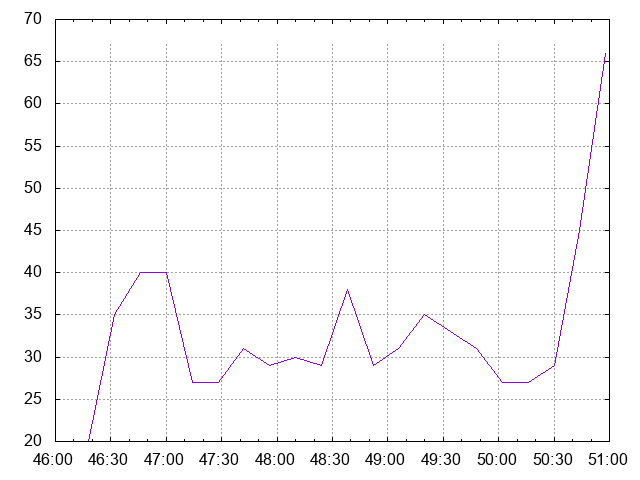

# Benchmark baseline results

Generated with:

```
load.sh [-h] [-r n] [-c n] [-m n] [-q n] [-o csv|gnuplot] -- program to test synthetic load on observatorium gateway and report results.

where:
    -h  show this help text
    -r  set number of seconds to run (default: 300)
    -c  set number of cluster to simulate (default: 5000)
    -m  set number of machines per cluster to simulate (default: 2)
    -q  set number of concurrent queries to execute (default: 10)
    -o  set the output format (default: csv. options: csv, gnuplot)
```

```
./test/load.sh -r 300 -c 5000 -m 1 -q 5 -o gnuplot
```

## CPU Usage


## Memory Usage


## Number of Goroutines



## Write Latency Qunatiles

### 99th


### 50th


### Average


## Query Latency Qunatiles

### 99th


### 50th


### Average


