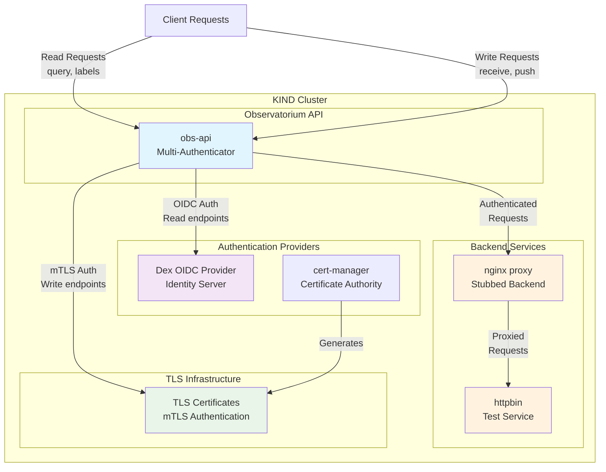

# KIND Mixed Authentication Tests

This directory contains end-to-end tests for the Observatorium API's multi-authenticator feature using in KinD.
Certificates are generated using cert-manager, and an OIDC provider (Dex) is deployed for authentication testing. 
The tests verify that the API correctly routes requests to the appropriate authentication method 
based on path patterns and enforces RBAC authorization.

Endpoints are stubbed to backend services (nginx proxy and httpbin) to validate that authenticated requests are properly forwarded.

## Overview

The tests verify that:
- Read endpoints (query, labels, etc.) use OIDC authentication
- Write endpoints (receive, push) use mTLS authentication  
- Path-based authentication routing works correctly
- RBAC authorization is enforced

## Prerequisites

- KinD
- kubectl

## Quick Start

1. **Set up the test environment:**
   ```bash
   make setup
   ```
   This will:
   - Create a KIND cluster named `observatorium-auth-test`
   - Deploy cert-manager for TLS certificate generation
   - Deploy TLS certificates
   - Deploy backend services (nginx proxy, httpbin)
   - Deploy Dex OIDC provider
   - Extract certificates and generate configuration
   - Deploy the Observatorium API with mixed authentication

2. **Run the tests:**
   ```bash
   make test
   ```

3. **Clean up:**
   ```bash
   make teardown
   ```


## Architecture



The architecture demonstrates:

- **Path-based routing**: Different endpoints use different authentication methods
- **OIDC Authentication**: Read endpoints (query, labels) authenticate via Dex OIDC provider
- **mTLS Authentication**: Write endpoints (receive, push) use mutual TLS certificates
- **Backend proxying**: Authenticated requests are forwarded to stubbed backend services
- **Certificate management**: cert-manager handles TLS certificate lifecycle

